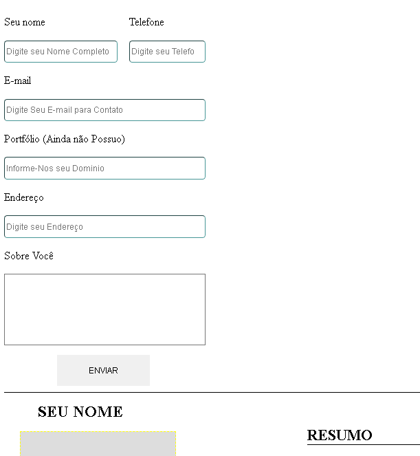
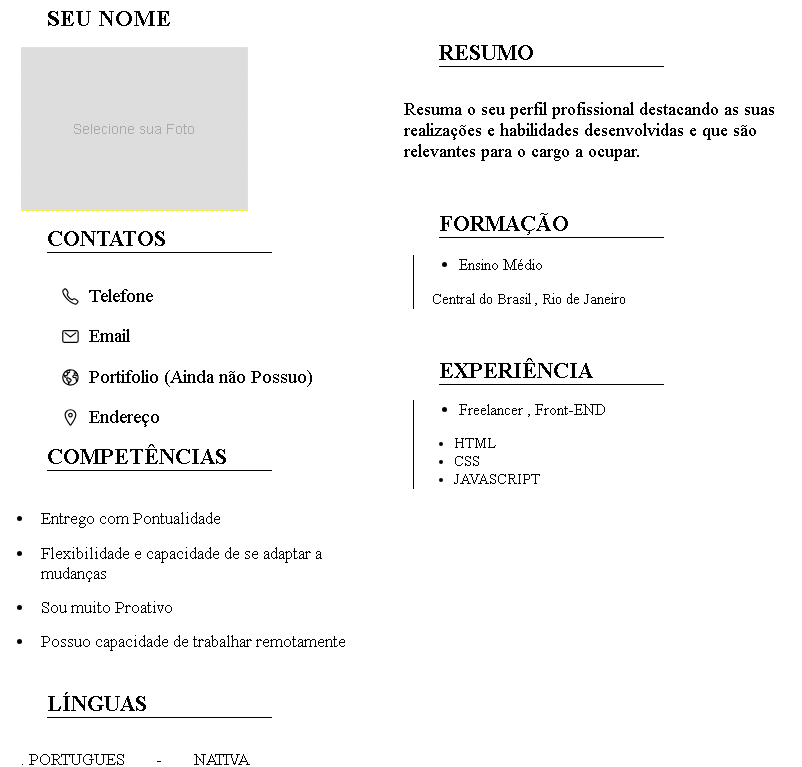

<h1 align="center"> Currículo Input </h1>

Meu primeiro mini-projeto pessoal para desenvolver minhas habilidades

 

  

  

(Em desenvolvimento)

 

## 🚀 Tecnologias

Esse projeto foi desenvolvido com as seguintes tecnologias:

- HTML e CSS
- JavaScript
- Git e Github

## 💻 Projeto

O Currículo Input é um projeto que você monta um currículo rapidamente.

Feito com ♥ by Allyson Felipe :wave:
